# Crypto Risk Dashboard - Architecture Diagrams

## 1. High-Level System Architecture

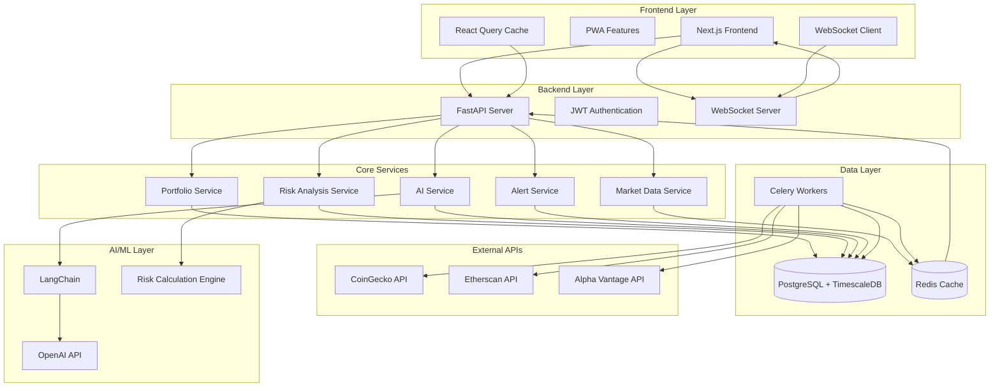

## 2. Data Flow Pipeline

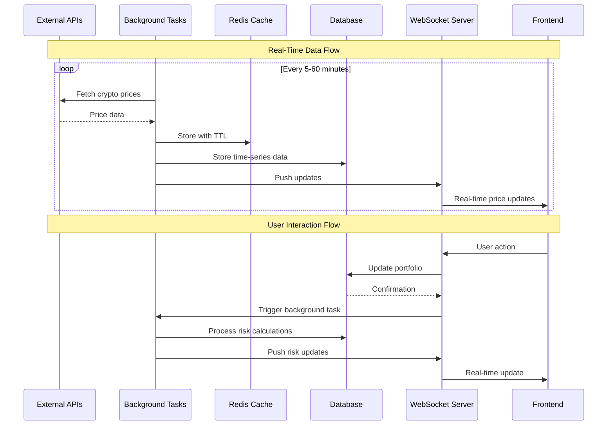

## 3. Database Schema (Entity Relationship)

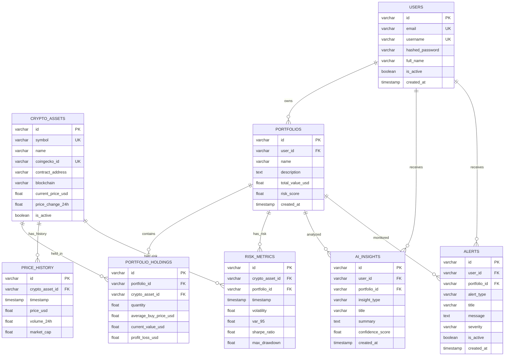

## 4. Real-Time Data Flow

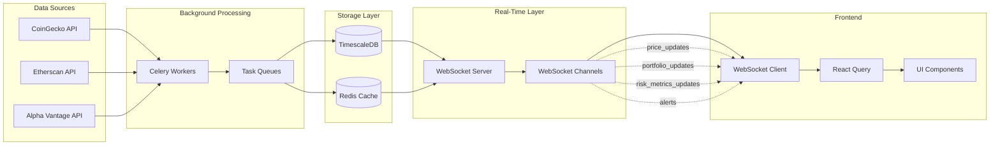

## 5. Background Task System

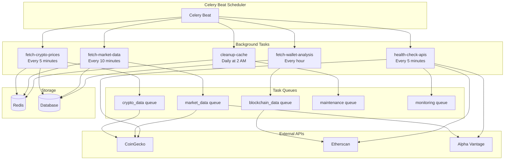

## 6. Risk Calculation Engine

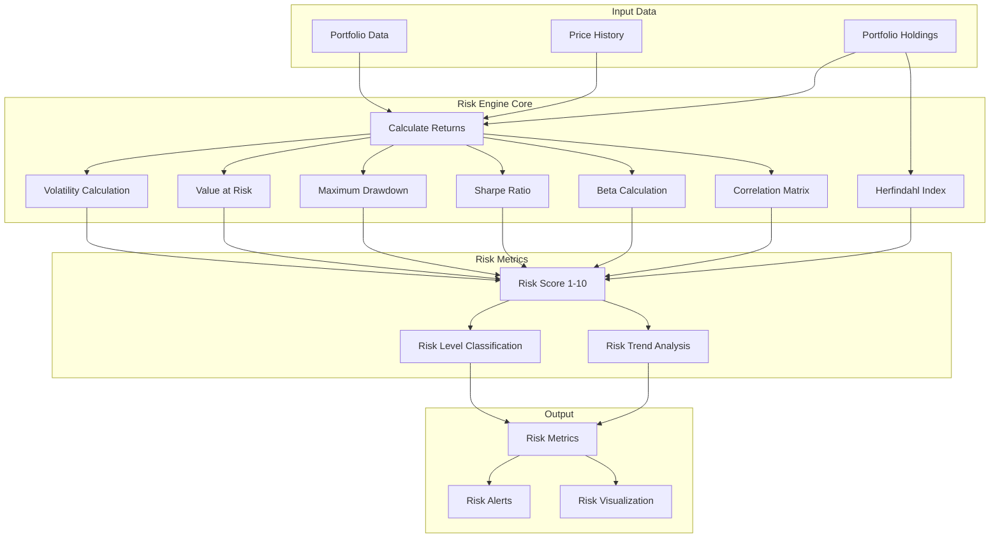

## 7. AI Insights Pipeline

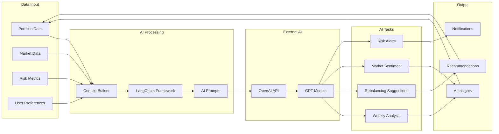

## 8. Frontend Component Architecture

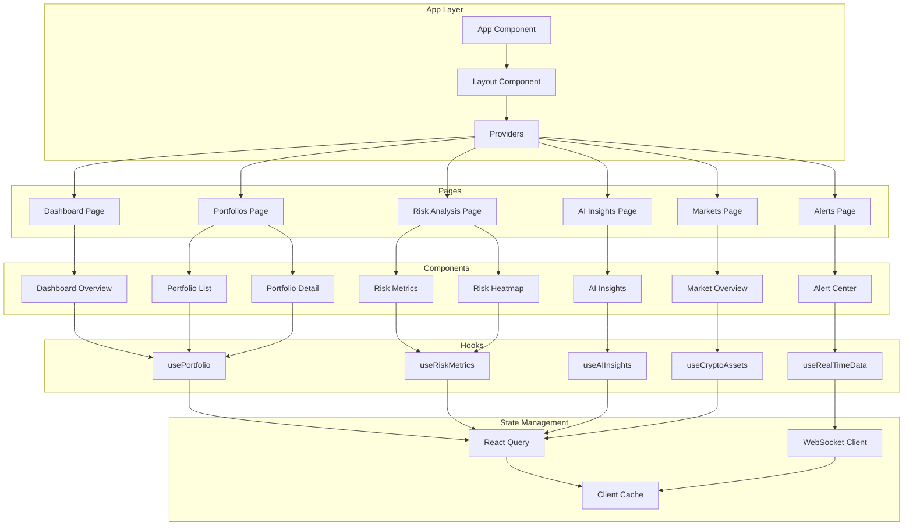

## 9. API Integration Layer

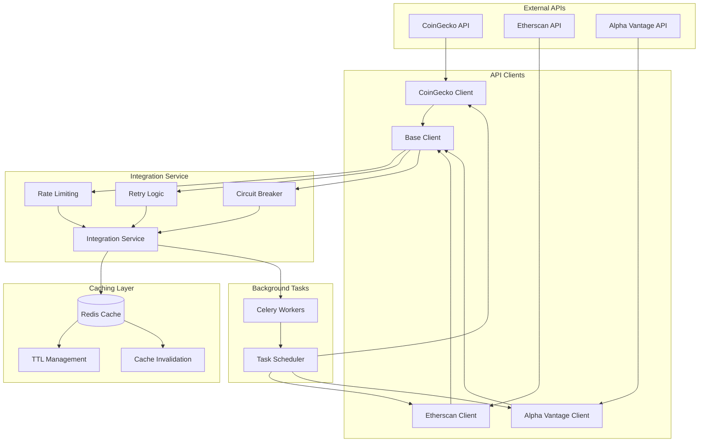

## 10. Deployment Architecture

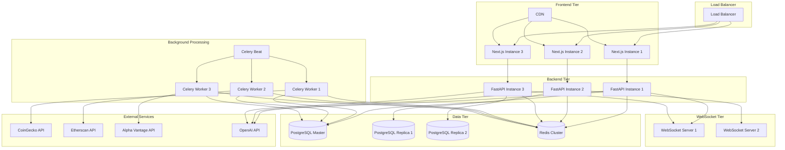

## Performance Metrics & Monitoring

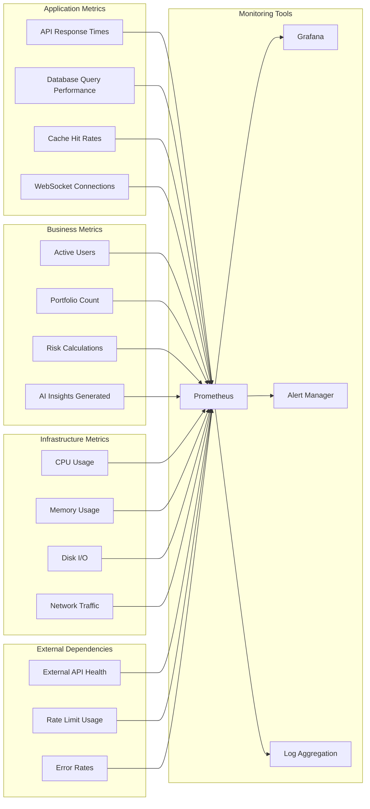

This comprehensive set of diagrams provides a complete visualization of your crypto risk dashboard architecture, covering all major components, data flows, and system interactions as specified in your prompt.
